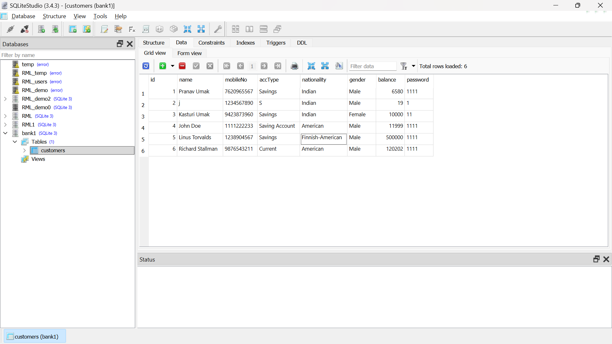

# Bank-Manegement-App

Banking Management System
Project in python with use of Tkinter GUI toolkit

About
A simple bank management system using Python and Tkinter for GUI and Sqlite3 database. The program allows users to create a new account by entering their personal details, log in to their account using their username and password, view their personal details, deposit and withdraw money. The program uses the `sqlite3` database to create and read files for storing user information and the `Tkinter` module to create the graphical user interface.

Packages required
Tkinter - Tkinter is the standard GUI library for Python.
Pillow - The pillow module required for fetching the images.

Installation
Tkinter
We just need to install Python from www.python.org, and it comes along with Python.
We do not need to install it separately.

Usage

Execution flow (How to run the program?)
Option 1

1. First extract the zip file.
2. Navigate to the file main.py
3. Launch the code in any of the supporting IDE/code editors. (for eg. VS CODE and you must have python pre-installed in your system)
4. Run the code by typing the below command on command line.
   `python main.py`
5. Now you are ready to interact with our python-based GUI program.
6. At First you will see two options:
   1. Register
   2. Login
7. Create your account if not already registered
8. You can check your Personal Details Or Deposit the money Or Withdraw it.

Images

